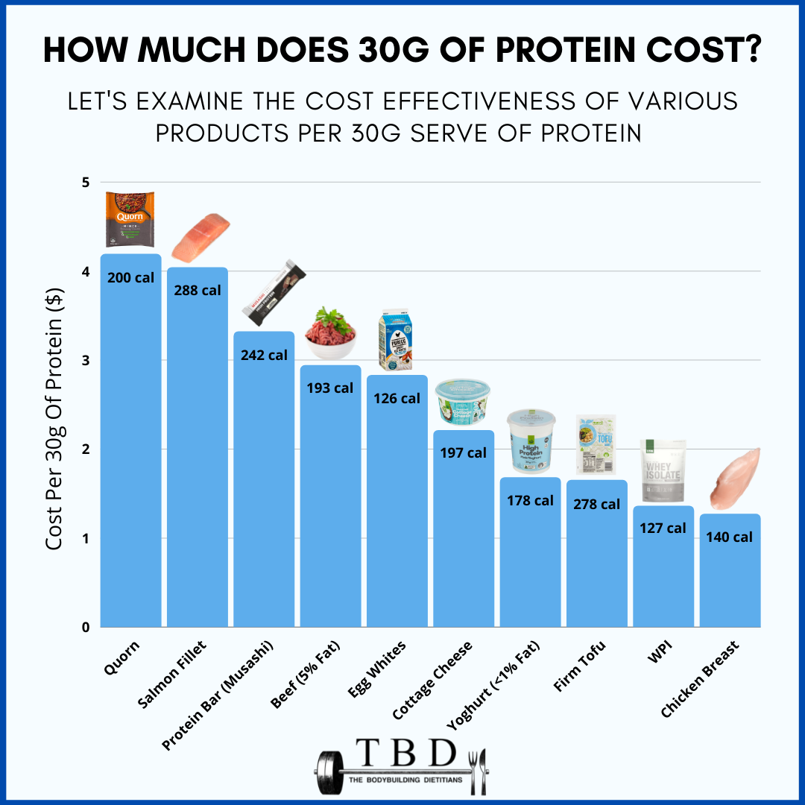
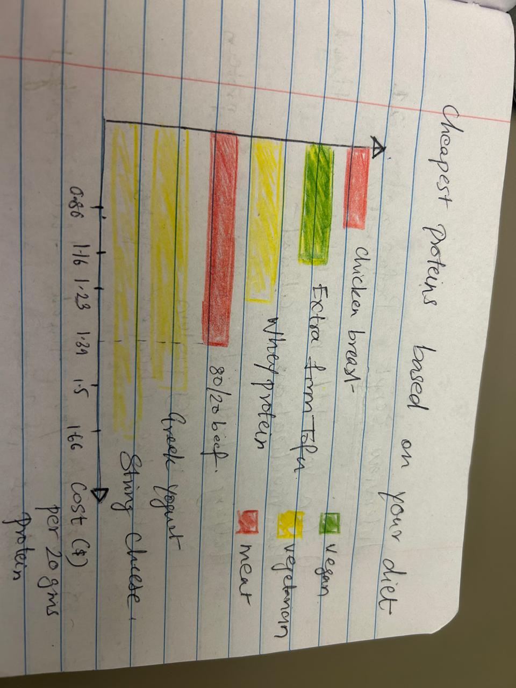
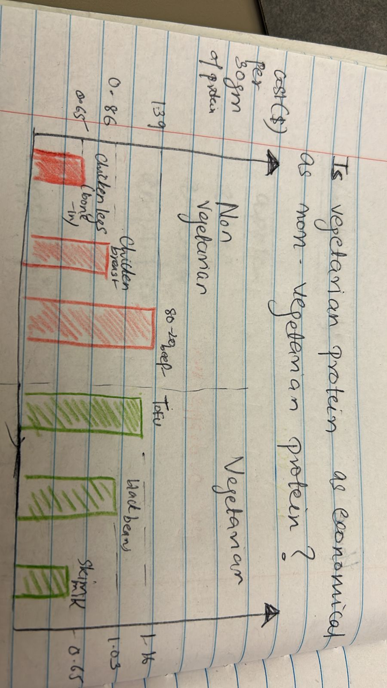

# Critique by design with Tableau 

## The original Visualization and dataset 

The dataset consists of the following columns
1) Protein_soure - various sources of protein
2) cost_per_20_grams_of_protein_us_dollars - cost of 20 grams of the protein in USD
3) cost_per_package - cost of one package of this protein source
4) total_protein_per_package_g - total protein in one package
5) vegetarian - Boolean variable for whether this protein source is vegetarian or not
6) vegan - Boolean variable for whether this protein source is vegan or not
7) notes - any additonal information

source - https://www.thebodybuildingdietitians.com/blog/how-cost-effective-is-your-high-protein-diet

## Critique of the visualization
I critqued the visualization by rating it on the below criteria out of 10 and then answering some questions 

Usefulness.  Is it useful for the intended audience?  Does it communicate valuable information? - 8

Completeness.  Does the visualization have everything necessary to make it understandable? - 6

Perceptibility.  Can the reader understand the information with minimal effort? Is the visualization type appropriate?  Does it use illogical comparisons? - 5

Truthfulness.  Is the visualization accurate, reliable and valid?  Is it representing what it says it is, and in the most complete and truthful manner? Does it misrepresent the data or make comparisions that aren't correct? - 5

Intuitiveness.  Is it easy to understand and clearly communicates the information?  If unfamiliar, does it include easy to understand instructions on how to interpret it? - 7

Aesthetics.  It is interesting / enjoyable to look at?  Is it a good example of what a beautiful data visualization might look like?  Is it somewhere in the middle - pleasing but otherwise not distracting to look at? - 3

Engagement.  Does it lead the audience to learn more about the topic?  Does it inspire the audience to talk about the data or share it with others? - 7

Describe your overall observations about the data visualization here.  What stood out to you?  What did you find worked really well?  What didn't?  What, if anything, would you do differently? 

Overall, I liked the visualization because the purpose felt clear — showing the cost of 30g of protein across different sources. What immediately stood out to me was the use of images on top of each bar representing the various protein sources. However, I found these images somewhat distracting, as they didn’t add significant value to the data and purpose of the visualization; instead, they drew unnecessary attention. It took me some time to see that chicken breast is the cheapest for 30 grams of protein, maybe that could be highlighted from the rest to focus on that insight. What worked well was the ease of comparison. The chart made it simple to visualize and compare the costs across protein sources, allowing for clear differentiation to help decision making for the audience. However I did not feel the visualization is telling us a story, Is vegetarian , vegan protein more expensive ? Is meat more calorie friendly for same amount of protein? I feel that this could be highlighted better. I would definitely use colors for each category for example Meat being red , vegan green , vegetarian a shade of grey and have a legend for it

Who is the primary audience for this tool?  Do you think this visualization is effective for reaching that audience?  Why or why not?

The primary audience for this visualization includes gym-goers and fitness enthusiasts who are focused on meeting their protein intake goals while being mindful of their budget. The chart effectively shows the most affordable protein sources, which can assist them in making informed purchasing decisions. However, the varying calorie content for each protein source introduces some ambiguity. While the chart displays calorie values, it may leave viewers uncertain about which option truly offers the best balance between cost of protein and caloric intake, potentially leading to confusion in determining the most suitable choice for their needs

Final thoughts: how successful what this method at evaluating the data visualization you selected? Are there measures you feel are missing or not being captured here?  What would you change?  Provide 1-2 recommendations (color, type of visualization, layout, etc.)*
Your answer

I found this evaluation method valuable because it encouraged me to think intuitively about what aspects of the visualization work well and what could be improved. The different criteria for rating, especially "truthfulness," prompted me to consider dimensions I hadn't previously focused on, resulting in a more comprehensive and holistic assessment of the visualization. For this particular visualization, I would recommend simplifying the design by focusing solely on cost and potentially removing the calorie information from the bars, as it may introduce unnecessary complexity. Additionally, removing the food icons could make the chart cleaner and more streamlined. To enhance credibility, I’d also suggest including some context about the source of the price data, helping readers trust the information presented.

## Sketching out potential solutions 

In planning the redesign, I focused on how best to visualize the data to tell a clear, compelling story. I started by deciding to use distinct colors to represent non-vegetarian, vegetarian, and vegan protein sources, making it easy for viewers to differentiate between these categories at a glance. I also chose to switch the axes, placing cost on the x-axis, which feels more intuitive for interpreting price comparisons.
To enhance clarity, I arranged each protein source in ascending order, from the lowest-cost options at the top to the highest-cost options at the bottom. Another concept I sketched involved a direct comparison between vegetarian and non-vegetarian protein sources. The goal here is to illustrate how accessible and cost-effective it is to meet protein needs as a vegetarian compared to a non-vegetarian. By placing these two groups side by side, I hope to highlight any noticeable differences in affordability and availability of protein sources across dietary preferences.

