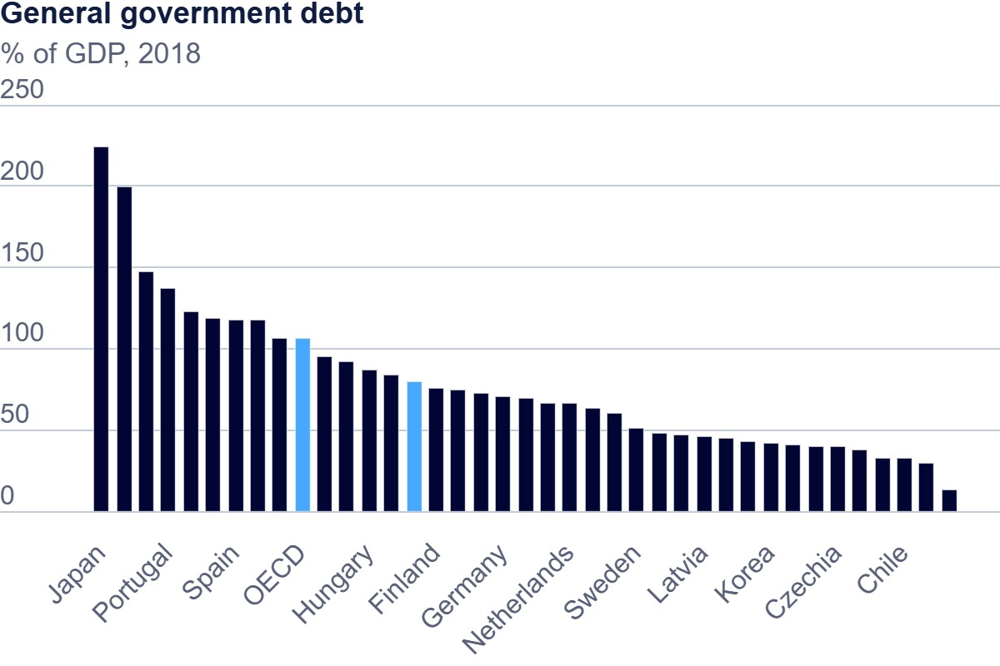

# Government Debt to GDP ratio visualizations

# Part 1 

#Part 2 

<noscript></noscript><object class='tableauViz'  style='display:none;'><param name='host_url' value='https%3A%2F%2Fpublic.tableau.com%2F' /> <param name='embed_code_version' value='3' /> <param name='site_root' value='' /><param name='name' value='Govt_debt-GDP_ratio&#47;debt_gdp_ratio-source-OECDData' /><param name='tabs' value='no' /><param name='toolbar' value='yes' /><param name='static_image' value='https:&#47;&#47;public.tableau.com&#47;static&#47;images&#47;Go&#47;Govt_debt-GDP_ratio&#47;debt_gdp_ratio-source-OECDData&#47;1.png' /> <param name='animate_transition' value='yes' /><param name='display_static_image' value='yes' /><param name='display_spinner' value='yes' /><param name='display_overlay' value='yes' /><param name='display_count' value='yes' /><param name='language' value='en-US' /></object>
            

# Part 3

This chart shows a comparison Government debt as a percentage of GDP for 1996 vs 2018 for diffrent countries

<noscript></noscript><object class='tableauViz'  style='display:none;'><param name='host_url' value='https%3A%2F%2Fpublic.tableau.com%2F' /> <param name='embed_code_version' value='3' /> <param name='site_root' value='' /><param name='name' value='Debt-GDP_ratio2&#47;Sheet1' /><param name='tabs' value='no' /><param name='toolbar' value='yes' /><param name='static_image' value='https:&#47;&#47;public.tableau.com&#47;static&#47;images&#47;De&#47;Debt-GDP_ratio2&#47;Sheet1&#47;1.png' /> <param name='animate_transition' value='yes' /><param name='display_static_image' value='yes' /><param name='display_spinner' value='yes' /><param name='display_overlay' value='yes' /><param name='display_count' value='yes' /><param name='language' value='en-US' /><param name='filter' value='publish=yes' /></object>
             
Different visualization methods serve unique purposes, helping to convey data insights effectively depending on the story being told. Bar charts, like 

the one used here, are excellent for comparing discrete values across categories, making it easy to see differences within a dataset. Line charts, on

the other hand, are ideal for showing trends over time, highlighting fluctuations or patterns. Heatmaps can reveal intensity and concentration across

variables, useful for large datasets where subtle differences need to be highlighted. Choosing the right visualization involves balancing clarity with

insight—selecting a format that emphasizes the most relevant aspects of the data for the intended audience.

Different visualization methods highlight data in unique ways. Bar charts, like this one, are great for comparing values across categories, making

differences easy to spot. Line charts show trends over time, emphasizing changes. Heatmaps reveal intensity and concentration, useful for spotting

patterns in large datasets. The right choice depends on what story you want to tell, aiming for clarity and insight tailored to your audience

[back home](/README.md)
