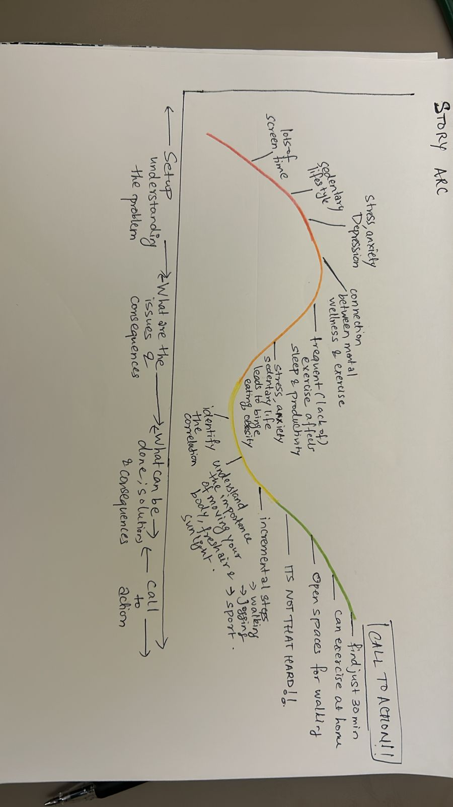

# Final Project part 1 

## Outline 

In today’s fast-paced world, mental health challenges are more prevalent than ever, with stress, anxiety, and depression impacting millions globally. While traditional approaches to mental health management often focus on therapy or medication, the transformative power of exercise and sports is frequently overlooked. This project aims to highlight the profound relationship between physical activity and mental well-being, backed by data and visual storytelling.

Through this project, I aim to show:

1) How mental health has worsened in sedentary populations over time.
2) The specific benefits of exercise and sports on reducing stress, anxiety, and depression.
3) Practical, evidence-based recommendations for integrating movement into daily life.

What the readers will gain: 

1) Awareness: Understand the undeniable link between physical activity and mental health improvement.
2) Actionable Insights: Learn how small, consistent changes in activity levels can lead to significant mental health benefits.
3) Tools for Change: Access recommendations and resources for incorporating exercise into daily routines.
4) Empowerment: Discover achievable ways to enhance mental health and well-being through movement.

### Story arc 

My story will start my talking about the problem , what are the issues that lead to it and its consequences , what are possible solutions and how beneficial it can be and I will end with a call to action which every single reader can implement from day 1 without any constraints. That is my goal - to show my readers that exercise is not complicated , it is easy and you just need to start ! Below is a draft of how I plan to narrate this story

1. Setup (Understanding the Problem):
High screen time and sedentary lifestyles are leading to stress, anxiety, and depression, creating a cycle of worsening mental health.

2. Identifying the Issues and Consequences:
This cycle often results in reduced productivity, poor sleep, and an overall decline in well-being.

3. Understanding the Correlation:
There’s a clear connection between sedentary behavior and mental health challenges. Recognizing this link is the first step to change.

4. What Can Be Done (Solutions):
Incorporating regular physical activity, even incrementally, can significantly improve sleep, productivity, and overall mental health. Activities like walking, jogging, and spending time outdoors are simple yet effective.

5. Call to Action:
It’s not as hard as it seems! Just 30 minutes of movement—whether at home or outdoors—can make a huge difference. Start small, stay consistent, and reclaim your well-being.

## Sketches 

## Method and medium 
For implementing my project, I will be utilizing the following tools:

Shorthand: To craft and present my story narrative in a clear and engaging way.
Tableau and DataWrapper: For designing interactive and impactful data visualizations.
Canva: To create custom visuals that align seamlessly with my story arc.
Additionally, I plan to incorporate reference graphics, such as explanatory charts, to help the audience quickly grasp the key takeaways from the data.
