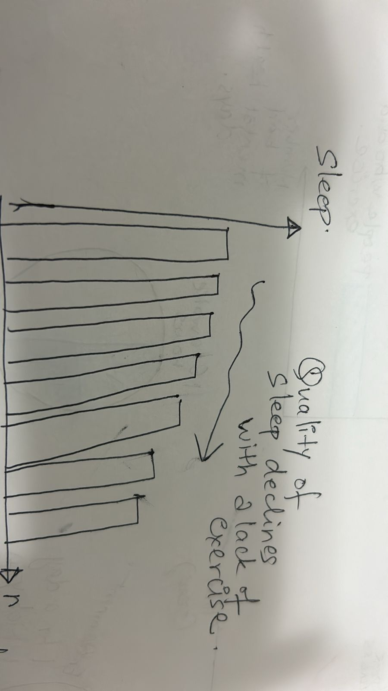

# Final Project part 1 

## Outline 

In today’s fast-paced world, mental health challenges are more prevalent than ever, with stress, anxiety, and depression impacting millions globally. While traditional approaches to mental health management often focus on therapy or medication, the transformative power of exercise and sports is frequently overlooked. This project aims to highlight the profound relationship between physical activity and mental well-being, backed by data and visual storytelling.

Through this project, I aim to show:

1) How mental health has worsened in sedentary populations over time.
2) The specific benefits of exercise and sports on reducing stress, anxiety, and depression.
3) Practical, evidence-based recommendations for integrating movement into daily life.

What the readers will gain: 

1) Awareness: Understand the undeniable link between physical activity and mental health improvement.
2) Actionable Insights: Learn how small, consistent changes in activity levels can lead to significant mental health benefits.
3) Tools for Change: Access recommendations and resources for incorporating exercise into daily routines.
4) Empowerment: Discover achievable ways to enhance mental health and well-being through movement.

### Story arc 

My story will start my talking about the problem , what are the issues that lead to it and its consequences , what are possible solutions and how beneficial it can be and I will end with a call to action which every single reader can implement from day 1 without any constraints. That is my goal - to show my readers that exercise is not complicated , it is easy and you just need to start ! Below is a draft of how I plan to narrate this story

I will be using some personal data I have collected from my Iphone regarding my sleep and genera

1. Setup (Understanding the Problem):
High screen time and sedentary lifestyles are leading to stress, anxiety, and depression, creating a cycle of worsening mental health.

2. Identifying the Issues and Consequences:
This cycle often results in reduced productivity, poor sleep, and an overall decline in well-being.

3. Understanding the Correlation:
There’s a clear connection between sedentary behavior and mental health challenges. Recognizing this link is the first step to change.

4. What Can Be Done (Solutions):
Incorporating regular physical activity, even incrementally, can significantly improve sleep, productivity, and overall mental health. Activities like walking, jogging, and spending time outdoors are simple yet effective.

5. Call to Action:
It’s not as hard as it seems! Just 30 minutes of movement—whether at home or outdoors—can make a huge difference. Start small, stay consistent, and reclaim your well-being.

## Sketches 

## The data 

I will be using the following sources of data for my project 
1) My personal iphone health app data which has data on calories burnt and sleep. I plan to use this data to show how exercise can lead to better sleep through my own personal experiences. Below are some screengrabs of what the data looks like
   
   
   

2) https://www.cdc.gov/physical-activity/php/data/inactivity-maps.html - The CDC's physical inactivity data highlights the prevalence of adults in the U.S. who report no physical activity outside of work. The maps show regional and state-level variations, with the South having the highest inactivity rates and the West the lowest. It also reveals disparities by race and ethnicity, emphasizing the need for targeted interventions to promote physical activity

3) https://www.cdc.gov/brfss/annual_data/annual_2015.html - The 2015 Behavioral Risk Factor Surveillance System (BRFSS) data, accessible at the provided link, comprises health-related information from over 441,000 U.S. adults. It includes variables such as exercise habits and self-reported mental health status, enabling analyses of associations between physical activity and mental well-being. I will use the Centers for Disease Control and Prevention Behavioral Risk Factors Surveillance System survey to compared the number of days of bad self-reported mental health between individuals who exercised and those who did not
   
4) https://explodingtopics.com/blog/smartphone-usage-stats - This is a great dataset on smartphone usage and addiction, it has data on time spent on smartphones , average amount  I am going to use this as a part of my argument that there is infact time to exercise! We use our smartphones for hours on end daily doom scrolling - this is a cause of anxiety and depression, rather we can take out 30-40 minutes of that time and move our body , get some sunshine and it will have a exponential impact on mental health and wellness and smartphone addictions will come down drastically 

5) https://www.kaggle.com/datasets/nguyenngocphung/behavioral-risk-factor-surveillance-system2013 - Behavioral Risk Factor Surveillance System (BRFSS) for 2013, which collects data on various health-related behaviors, chronic diseases, and preventive health measures from adults across the U.S. It includes information on exercise, sleep, mental health, and other behavioral factors, making it highly relevant to my project.

6) Individuals I know who I have reccomended exercise to , surveys from their experience and positive changes 

These are just a few of the sources from a vast amount of data I plan to explore and utilize 
## Method and medium 
For implementing my project, I will be utilizing the following tools:

Shorthand: To craft and present my story narrative in a clear and engaging way.
Tableau and DataWrapper: For designing interactive and impactful data visualizations.
Canva: To create custom visuals that align seamlessly with my story arc.
Additionally, I plan to incorporate reference graphics, such as explanatory charts, to help the audience quickly grasp the key takeaways from the data.
